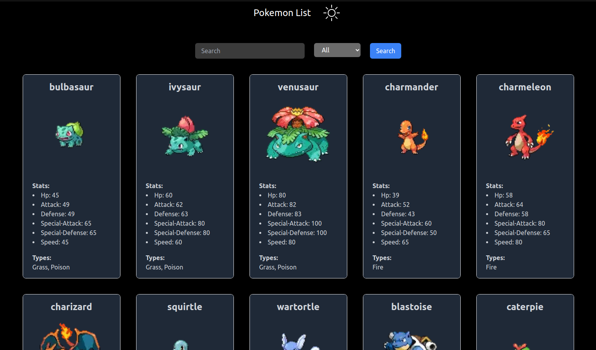

### Challenge Full Stack Natural - Frontend

# Technologies

- Next
- Tailwind
- Typescript
- RTK Query
- EsLint
- Prettier
- Husky (pre-commit): for linting and conventional commits.

## Installation

```bash
git clone <repo>

npm install

npm run dev # for development

```

Go to repo : [Backend](https://github.com/jonatan-c/natural--backend.git) and follow the instructions to run the backend.

## Images



## Clarifications:

- For simplicity i put the .env file in the repo, but in a real project it should be in the .gitignore file.
- The Frontend has port 3000 in repo, dockerfile and docker-compose for simplicity, but in a real project it should be in the .env file.
- The backend has port 4000 in repo, dockerfile and docker-compose for simplicity, but in a real project it should be in the .env file.